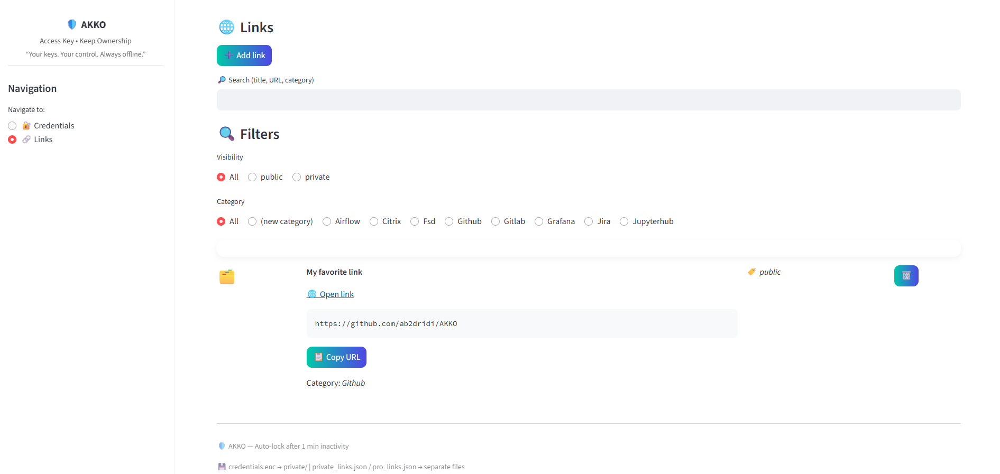

# 🛡️ AKKO

**AKKO** (Access Key Keep Ownership) is a **simple, secure, and serverless** password and credential manager designed to keep your data under your control.  
Built with [Streamlit](https://streamlit.io/), it focuses on **simplicity**, **privacy**, and **data sovereignty**.

---

## ✨ Main Features

- Clean and intuitive interface (no endless menus or clutter)  
- Local encryption using `cryptography.Fernet`  
- Smart search and filtering of credentials  
- Quick link and token management  
- 100% offline: no external servers or databases  
- Auto-lock after inactivity for extra security

---

## 🚀 Launching the App

### 🖱️ Easiest Way

Just **double-click** the script `akko.py`.  
The app will open automatically in your browser (usually at [http://localhost:8501](http://localhost:8501)).

> ⚠️ No admin rights required.

---

### 🧑‍💻 Manual Launch (if needed)

If you prefer the old-school terminal way:

```bash
cd path/to/project
python -m streamlit run app.py
```

---

## 📦 Installation

Make sure you have **Python 3.9+** installed.  
Then, from your project folder:

```bash
python -m venv .venv
.venv\Scripts\activate
pip install -r requirements.txt
```

> If you can’t install globally, the local virtual environment works perfectly fine.  
> No admin privileges are required.

---

## 🧰 Useful Files

| File | Description |
|------|--------------|
| `app.py` | Main entry point of the app |
| `modules/` | Contains the pages: credentials, links, etc. |
| `utils/` | Security, encryption, and helper functions |
| `akko.py` | Launch script (no console, no admin) |
| `streamlit.log` | Application log file |
| `config.yaml` | Configuration (timeouts, preferences, etc.) |
| `requirements.txt` | List of dependencies required to run AKKO |

---

## 📄 requirements.txt

Below is the recommended dependency list for AKKO:

```txt
streamlit>=1.38.0
cryptography>=43.0.0
pandas>=2.2.0
PyYAML>=6.0.2
watchdog>=4.0.0
requests>=2.32.0
```

You can install them all with:

```bash
pip install -r requirements.txt
```

---

## 💾 Data Storage & First-Time Setup

When you run **AKKO** for the first time, the app automatically creates two main folders inside your project directory — one for **private encrypted credentials**, and one for **public assets and professional links**.

```
AKKO/
 ├── private/
 │    └── data/
 │         ├── credentials.enc        → encrypted credentials (passwords, tokens, SSH keys)
 │         └── private_links.json     → private or internal links (not encrypted, only tagged as private)
 │
 ├── public/
 │    └── data/
 │         ├── pro_links.json         → professional or public resources (shared or unencrypted)
 │         └── icons/                 → icons and static assets used by the UI
```

### 🧩 How It Works
- **Credentials** are the only data encrypted on disk, stored in `credentials.enc` using your master password and `cryptography.Fernet`.  
- **Private links** are stored in clear text but tagged as private, allowing you to filter and separate personal or internal resources without encrypting them.  
- **Public links** and icons are plain JSON/static files used by the UI and can safely be shared or versioned.  
- No standalone encryption key file is ever stored — the key is generated dynamically from your master password each session.

### 🔐 Your Master Password
On the first launch, AKKO prompts you to create a **master password**.  
This password:
- is used exclusively to encrypt and decrypt your credentials;  
- is **never stored**, transmitted, or recoverable;  
- must be remembered, since losing it means losing access to your credentials file.

### 📂 Moving or Backing Up Data
To back up or move AKKO to another machine:
1. Copy the entire `private/data/` folder.  
2. Paste it into the same location on the new environment.  
3. Launch AKKO and enter your master password to regain access.

`public/data/` can be copied or included in version control — it contains no secrets.

### ⚠️ Important Notes
- The `private/` folder is **excluded from Git** via `.gitignore`, ensuring credentials are never pushed online.  
- `private_links.json` is plain text: handle it responsibly if it contains internal URLs.  
- If you delete `private/data/`, AKKO will recreate a clean structure automatically at the next launch.

---

## 🧯 Troubleshooting

- **The app doesn’t start?**  
  → Check that Python is installed and accessible.  
  → Try `python -m streamlit --version`.

- **“Port already in use”?**  
  → Close other Streamlit sessions or change the port in `akko.py`.

- **`cryptography` error?**  
  → Install the missing dependency manually:  
    ```bash
    pip install cryptography
    ```

---

## 🔒 Security

- Data is **encrypted locally** before saving.  
- The encryption key is derived from your master password (never stored in plain text).  
- Auto-lock prevents unauthorized access after inactivity.

> AKKO collects **no data**, locally or remotely.

---

## 🌐 Philosophy

> **"Keep it simple. Keep it yours."**

AKKO is built on one belief:  
your secrets should belong to **you**, not to some third-party service.  
No cloud, no tracking, no nonsense — just your vault and your control.

---

## 📸 Screenshots

### 🔐 First Authentication


### ➕ Add Credentials


### 📂 View Stored Credentials


### 🌐 Add a Link


### 🔗 View Links


---

## 🧠 Author

Created with ❤️, caffeine, and mild frustration at closed systems.  
Developed by **ab2dridi**.  
Licensed under MIT — use it, improve it, and keep your freedom.
